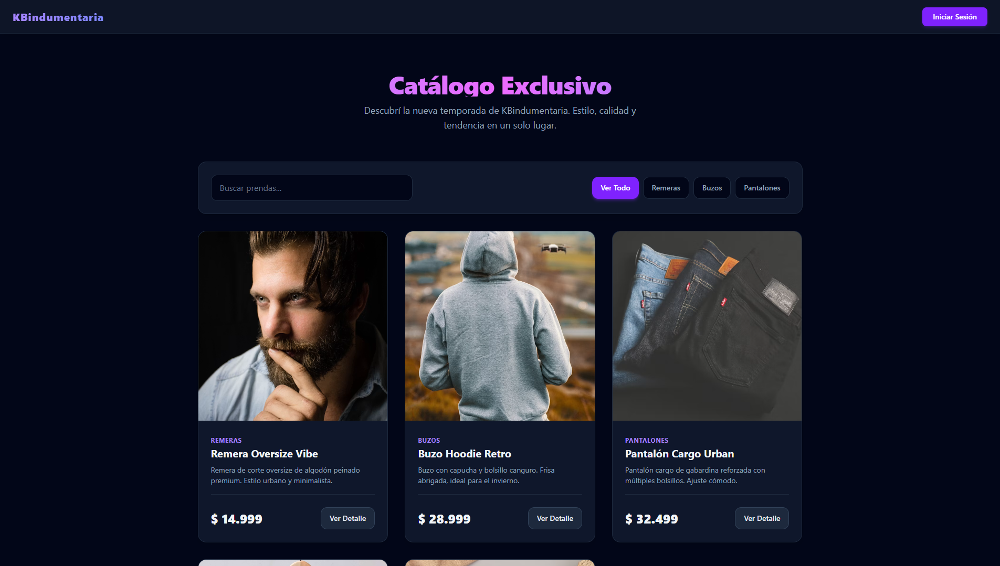

# KBindumentaria - E-Commerce de Indumentaria Urbana

Trabajo Práctico 2 para la materia **Plataformas de Desarrollo** de la carrera de Análisis de Sistemas.

## Información General
* **Nombre del Proyecto**: KBindumentaria
* **Integrante**: Mateo Agustin Bonanata
* **Tecnologías**: React.js, Tailwind CSS v4, React Router, React Toastify.
* **Sitio Web Activo (Vercel)**: [https://parcial-2-pd-bonanata.vercel.app/](https://parcial-2-pd-bonanata.vercel.app/)

---

## Vista Previa del Proyecto


---

## Descripción y Temática
**KBindumentaria** es una tienda virtual interactiva de ropa urbana orientada a la comercialización de prendas (remeras, buzos y pantalones). La aplicación está construida en una arquitectura 100% frontend (Single Page Application) sin conexión a bases de datos reales o APIs de backend, consumiendo datos simulados de un inventario local en formato JSON y gestionando la persistencia de la sesión mediante almacenamiento web (`localStorage`).

---

## Roles y Usuarios Disponibles
El sistema implementa una simulación de login y control de accesos restringido por roles de usuario:

| Usuario | Contraseña | Rol (Role) | Permisos y Acciones Permitidas |
| :--- | :--- | :--- | :--- |
| **admin** | `1234` | `admin` | **Administrador**: Acceso completo al Panel de Control (`/admin`) donde puede gestionar el stock de productos mediante operaciones CRUD completas (Crear, Editar, Listar y Eliminar prendas con validación local y confirmación modal de eliminación). |
| **user** | `1234` | `client` | **Cliente**: Acceso al catálogo interactivo (`/`), búsqueda y filtrado de productos por categorías en tiempo real, visualización del detalle del producto (`/product/:id`) y simulación de agregar prendas al carrito. |

---

## Funcionalidades Técnicas Implementadas
1. **Componentes Funcionales y Hooks**: Uso de componentes reutilizables con Hooks del estándar de React como `useState`, `useEffect`, `useContext` y `useParams`.
2. **Context API para el Estado Global (`AuthContext`)**: Manejo centralizado de la sesión del usuario (isLoggedIn, username y role) persistido en `localStorage` para conservar la sesión del usuario al recargar la pantalla.
3. **Navegación e Rutas Protegidas**: Configuración de `BrowserRouter`, `Routes` y `Route` mediante `react-router-dom` con redirecciones condicionales de acceso según los privilegios del usuario autenticado.
4. **Formularios Controlados y Validaciones**: Validación tanto para el formulario de login como para los campos de creación/modificación de stock en el Panel de Administración.
5. **Ventanas Modales con React Portals**: Implementación de confirmación de eliminación de stock renderizada directamente sobre el nodo `#modal` en el DOM raíz del documento.
6. **Notificaciones Interactivas**: Integración de alertas dinámicas mediante `react-toastify` para guiar al usuario en sus interacciones (agregar al carrito, login exitoso o confirmación de operaciones CRUD).
7. **Diseño Moderno y Responsivo**: Maquetación web estilizada con la estética oscura premium del sitio utilizando las utilidades y la configuración nativa de **Tailwind CSS v4**.

---

## Instrucciones de Instalación

Seguí estos pasos para clonar y ejecutar el proyecto localmente en tu entorno de desarrollo:

### 1. Clonar el repositorio y acceder a la carpeta
```bash
git clone https://github.com/MateoDelFlow/parcial-2-PD-bonanata.git
cd parcial-2-PD-bonanata
```

### 2. Instalar dependencias del proyecto
Instala todas las librerías necesarias del proyecto declaradas en `package.json` (React, React Router, Tailwind v4, React Toastify, etc.):
```bash
npm install
```

### 3. Levantar el entorno de desarrollo local
Inicia el servidor local de desarrollo de Vite:
```bash
npm run dev
```

Una vez ejecutado, abrí tu navegador e ingresá a la dirección local que te proporcione la terminal (usualmente `http://localhost:5173`).
